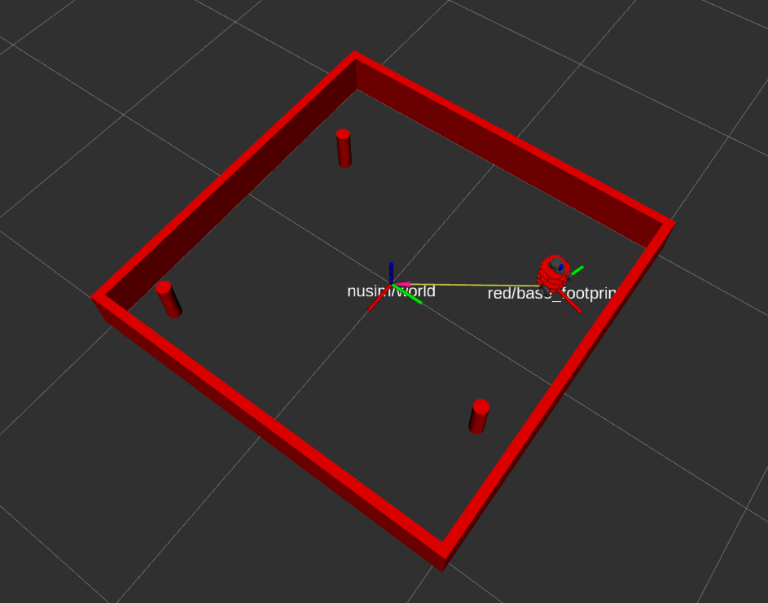

# NuSim Package
A package for simulating and visualization the turtlebot

# Launch File
* Use `ros2 launch nusim nusim.launch.py` to launch
* This should bring up rviz, a turtlebot, the arena, and 3 cylindrical obstacles

# Parameters
This package has the following parameters:
* rate: The rate at which the timer and publisher operates at
* x0: The initial x-coordinate of the turtlebot
* y0: The initial y-cooordinate of the turtlebot
* th0: The initial orientation of the turtelbot
* arena_x_length: The length of the arena in the x-direction
* arena_y_length: The length of the arena in the y-direction
* obstacles_x: An array rerpresenting the x-coordinates of the various obstacles
* obstacles_y: An array rerpresenting the y-coordinates of the various obstacles
* obstacles_r: The radius of the cylindrical obstacles

