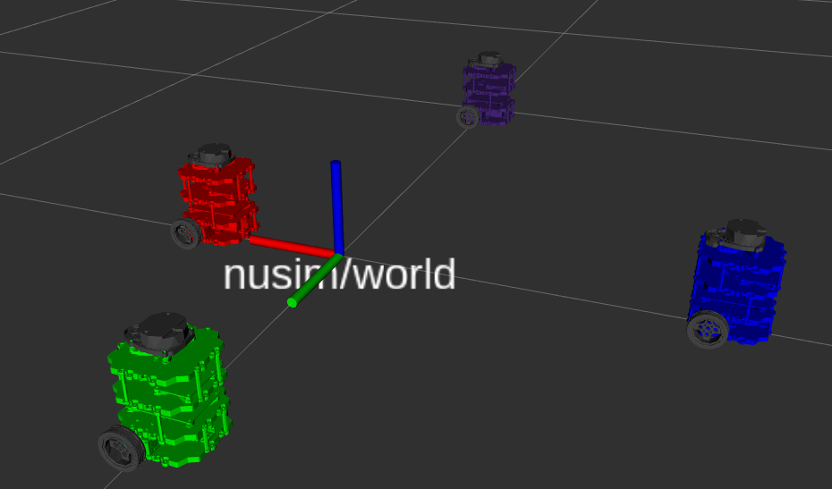

# Nuturtle  Description
URDF files for Nuturtle Sir SLAM-a-lot [1]
* `ros2 launch nuturtle_description load_one.launch.py` to see the robot in rviz.
* `ros2 launch nuturtle_description load_all.launch.py` to see four copies of the robot in rviz.

* The rqt_graph when all four robots are visualized (Nodes Only, Hide Debug) is:

# Launch File Details
* `ros2 launch nuturtle_description load_one.launch.py --show-args`
  ```
  Arguments (pass arguments as '<name>:=<value>'):

    'use_rviz':
        Launches rviz (true | false)
        (default: 'true')

    'use_jsp':
        Launches joint state publisher (true | false)
        (default: 'true')

    'color':
        Color of the turtlebot. Valid choices are: ['purple', 'red', 'green', 'blue', '']
        (default: 'purple')```
* `ros2 launch nuturtle_description load_all.launch.py --show-args`
  ```
  Arguments (pass arguments as '<name>:=<value>'):

    'use_rviz':
        Launches rviz (true | false)
        (default: 'true')

    'use_jsp':
        Launches joint state publisher (true | false)
        (default: 'true')

    'color':
        Color of the turtlebot. Valid choices are: ['purple', 'red', 'green', 'blue', '']
        (default: 'purple')
        ```